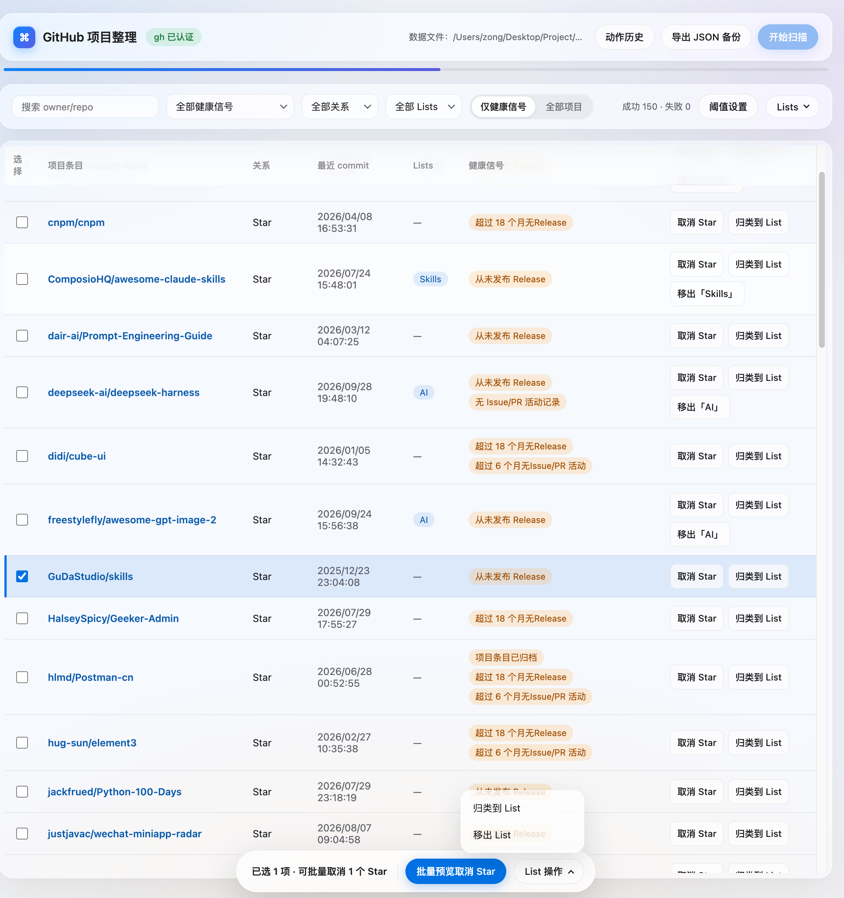

# GitHub 项目整理

一个运行在本机的 GitHub 项目整理工作台。它读取当前 GitHub 账号的 Star、本人拥有的仓库和 fork，合并成可筛选、可审阅、可安全确认的项目清单，帮助你集中处理长期无人维护、已归档或分类混乱的项目。

项目通过本机已经登录的 GitHub CLI（`gh`）访问 GitHub API，不在应用中读取或保存 GitHub Token。所有扫描和写入动作都由用户显式触发，适合个人在本地进行一次性或周期性整理。

## 目录

- [功能概览](#功能概览)
- [快速开始](#快速开始)
- [使用流程](#使用流程)
- [数据与安全](#数据与安全)
- [HTTP API](#http-api)
- [开发与测试](#开发与测试)
- [项目结构](#项目结构)
- [已知限制](#已知限制)

## 功能概览

### 扫描与审阅

- 扫描已 Star 项目，以及当前账号拥有的仓库（包含 fork）；按 owner/repo 去重。
- 保留 Star、Owned、Fork 关系，并记录 fork 来源、默认分支和关键时间点。
- 展示可解释的健康信号：archived、disabled、deprecated、长期无 commit、长期无 Release、长期无 Issue/PR 活动。
- 默认优先显示命中健康信号的项目，也可以切换到全部项目。
- 支持按关键词、健康信号、关系、语言和 GitHub List 筛选，并在详情 Dialog 中查看完整证据。

### 整理动作

- 取消或保留 Star。
- 将项目归类到 GitHub List，或从 List 移出；一个项目最多保留一个 List 归类。
- 对本人拥有的仓库执行 Archive、Unarchive。
- 删除本人拥有的仓库或 fork；删除入口只出现在详情 Dialog 的高级危险区域。
- 单项操作和批量操作均遵循“预览 → 显式确认 → 逐项执行”的流程，局部失败不会覆盖同批次的成功结果。
- 失败动作会保留原因并支持重试；本次成功取消 Star 的动作支持撤销。

### Lists 与规则

- 查看 List 概览、项目数量和待处理数量。
- 新建、重命名和删除 GitHub List。
- 维护“关键词 / Topic / 语言 → List”的规则，并查看每个项目的命中字段和命中值。
- 规则只生成建议，不会自动修改 GitHub；未 Star 的自有仓库不会出现 List 写操作入口。

### 本地状态

- 最近一次扫描、List、归类规则和操作审计统一保存到一个 JSON 文件。
- 使用临时文件和原子替换写入，支持导出备份。
- 保存时过滤 Token、Authorization、密码、密钥以及 README、Issue、PR 正文等敏感或大段内容。

## 快速开始

### 环境要求

- Node.js 18 或更高版本（建议使用当前 LTS）。
- pnpm（推荐通过 Corepack 管理）。
- GitHub CLI（`gh`），并已登录具有目标仓库操作权限的账号。

检查环境：

~~~bash
node --version
pnpm --version
gh --version
gh auth status
~~~

如果还没有 pnpm，可以在 Node.js 自带 Corepack 可用时执行：

~~~bash
corepack enable
~~~

macOS 安装 GitHub CLI 并登录：

~~~bash
brew install gh
gh auth login
~~~

### 安装并启动

~~~bash
pnpm install
pnpm start
~~~

然后打开 <http://127.0.0.1:4173>。启动日志会输出实际访问地址和本地 JSON 数据文件路径。

可以通过命令行参数或环境变量修改端口：

~~~bash
pnpm start -- --port 8080
PORT=8080 pnpm start
~~~

服务默认只监听 127.0.0.1。如确实需要从其他设备访问，可设置 HOST，但请先评估网络暴露和 GitHub 写操作风险：

~~~bash
HOST=0.0.0.0 PORT=8080 pnpm start
~~~

## 使用流程

1. 确认页面顶部显示“gh 已认证”，点击“开始扫描”。扫描不会在后台自动触发。
2. 在表格中使用搜索、健康信号、关系、List 和视图筛选，优先定位需要处理的项目。
3. 点击项目名称打开 GitHub；点击列表行的空白区域打开详情 Dialog，查看概览、健康证据、List 关系和建议命中原因。
4. 对单个项目使用行末动作按钮；多选项目后使用底部批量操作栏。所有写操作都会先展示预览。
5. 在预览中按动作组确认。执行结果会逐项展示，并写入动作历史；失败项可单独重试。
6. Archive、Unarchive 只对 Owned 项目开放。删除仓库需要二次确认，并输入完整的 owner/repo 名称。
7. 在“阈值设置”中调整健康判断阈值时，只会重新计算已有扫描结果，不会重新请求 GitHub 数据。
8. 在“动作历史”中查看扫描和写入记录；进行大量整理前，建议先导出 JSON 备份。

## 数据与安全

### 数据文件

默认数据文件位于项目根目录：

~~~text
./data.json
~~~

data.json 已加入 .gitignore。也可以使用 GITHUB_ORGANIZER_DATA 指定路径：

~~~bash
GITHUB_ORGANIZER_DATA=/绝对路径/github-organizer/data.json pnpm start
~~~

页面会显示实际数据文件路径，也可以请求 GET /api/data/path 查询。导出备份可以通过页面按钮完成，或者调用：

~~~bash
curl -X POST http://127.0.0.1:4173/api/data/export \\
  -H 'content-type: application/json' \\
  -d '{"path":"/目标路径/github-organizer.backup.json"}'
~~~

本地备份只能恢复整理工具保存的状态，不能回滚 GitHub 上已经执行的删除、Archive 或 List 变更。

### 默认健康阈值

| 健康信号 | 默认阈值 |
| --- | ---: |
| 没有新的 commit | 12 个月 |
| 没有新的 Release | 18 个月 |
| 没有 Issue/PR 活动 | 6 个月 |

archived 和 deprecated 会提高审阅优先级，但不会自动取消 Star。健康信号只提供证据和建议，最终动作始终由用户确认。

### 写操作护栏

- Star、List 和仓库生命周期动作都要求先预览再确认。
- 删除仓库前会展示完整身份、fork 来源、默认分支和健康证据，并要求输入准确的 owner/repo。
- 每个项目的成功、失败、待重试和撤销状态都会记录到本地审计历史。
- 项目不会保存 GitHub Token，也不会保存完整 README、Issue 或 PR 正文。

## HTTP API

服务端由 [src/server.js](./src/server.js) 提供，本地页面模板位于 [src/frontend.html](./src/frontend.html)。接口只绑定到本地服务地址。

### 状态、扫描与数据

| 方法 | 路径 | 作用 |
| --- | --- | --- |
| GET | /api/status | 查询 gh 认证状态 |
| GET | /api/scan | 读取最近一次扫描结果 |
| POST | /api/scan | 发起一次显式扫描 |
| GET | /api/progress | 查询扫描进度 |
| POST | /api/recalculate | 使用新阈值重新计算健康信号 |
| GET | /api/history | 读取扫描和动作审计历史 |
| GET | /api/data/path | 查询实际 JSON 文件路径 |
| POST | /api/data/export | 导出 JSON 备份 |

### Star 与批量动作

| 方法 | 路径 | 作用 |
| --- | --- | --- |
| POST | /api/actions/preview | 生成取消 Star / 保留关系预览 |
| POST | /api/actions/confirm | 确认并逐项执行 Star 动作 |
| POST | /api/actions/undo | 撤销最近一次成功的取消 Star |

### GitHub Lists

| 方法 | 路径 | 作用 |
| --- | --- | --- |
| GET | /api/lists | 查询 List 概览和归类规则 |
| POST | /api/lists/actions/preview | 生成归类或移出 List 的预览 |
| POST | /api/lists/actions/confirm | 确认并执行 List 动作 |
| POST | /api/lists | 新建 List |
| POST | /api/lists/rename | 重命名 List |
| POST | /api/lists/delete | 删除 List（二次确认） |
| POST | /api/lists/rules | 保存归类规则 |
| POST | /api/lists/rules/explain | 查询项目的规则命中解释 |

### 仓库生命周期

| 方法 | 路径 | 作用 |
| --- | --- | --- |
| POST | /api/repositories/lifecycle/preview | 生成 Archive、Unarchive 或删除预览 |
| POST | /api/repositories/lifecycle/confirm | 确认并执行生命周期动作 |

生命周期写操作只允许作用于本人拥有的项目条目。旧的直写兼容入口会返回 410 Gone，必须改用 preview/confirm 流程。

## 开发与测试

项目使用 Node.js 原生 HTTP 服务、单文件 HTML 前端和 Node.js 内置测试运行器，不需要额外的前端构建步骤。

~~~bash
# 类型与 JavaScript 语法检查
pnpm run typecheck

# 运行全部测试
pnpm test

# 一次完成检查
pnpm run typecheck && pnpm test
~~~

修改 [src/frontend.html](./src/frontend.html) 后重启本地服务即可加载最新页面。测试位于 [test/](./test/)，核心编排逻辑可以在不连接真实 GitHub 的情况下通过适配器替身测试。

## 项目结构

~~~text
src/
├── cli.js          # 启动本地服务、解析端口和数据文件路径
├── server.js       # HTTP API 与首页路由
├── frontend.html   # 独立前端页面（HTML、CSS、浏览器端脚本）
├── frontend.js     # 读取并导出前端模板
├── orchestrator.js # 扫描、健康信号、预览、确认、审计和重试
├── gh-adapter.js   # GitHub CLI/API 适配与错误归一化
└── storage.js      # JSON 原子写入、敏感字段过滤和备份
~~~

## 已知限制

- 这是本地单用户工具，不提供远程多设备访问、账号管理或后台定时同步。
- 扫描依赖 GitHub API 权限和速率限制；部分健康证据不可用时会保留失败原因，不会伪装成完整成功。
- List、Archive、Unarchive 和删除等写操作依赖当前 GitHub 账号的实际权限。
- 删除仓库等 GitHub 外部动作可能不可恢复，本地 JSON 备份不能替代 GitHub 侧的恢复机制。

## 许可

当前仓库未声明开源许可证。如需在项目外分发或二次开发，请先确认仓库所有者的授权范围。

